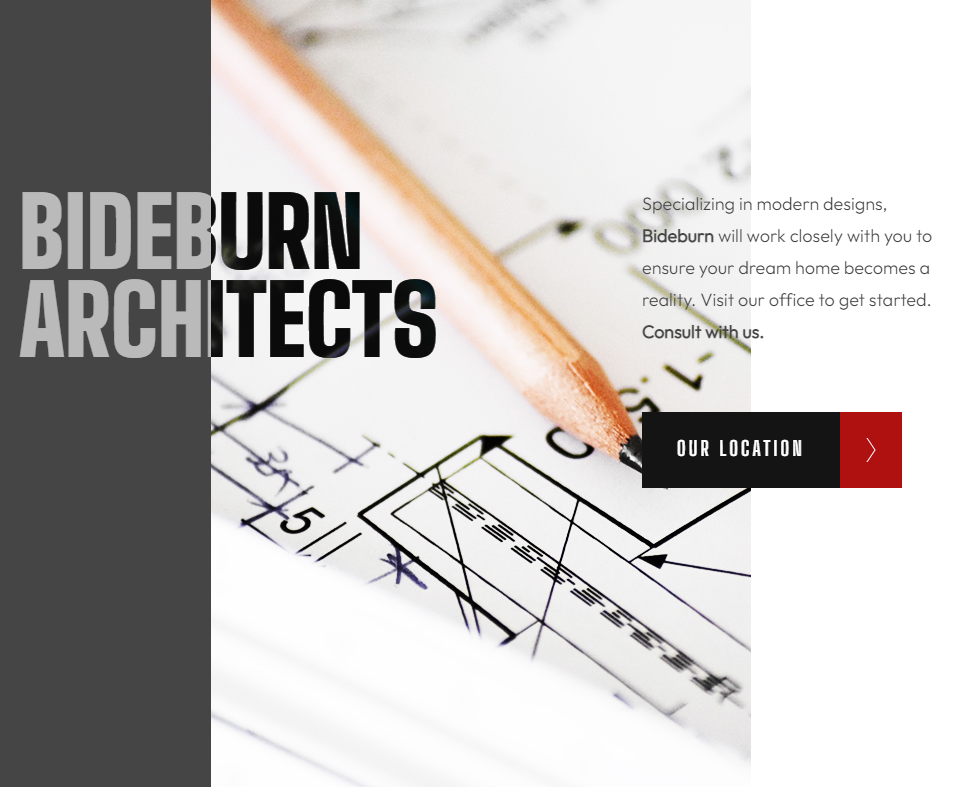

<h1 align="center">BONUS PORTFOLIO PROJECT: ART GALLERY ELEVATION</h1>
<h2 align="center">by Kevin O'Haugherty</h2>

 

## The Objective
The assignment was to take an art gallery website template, rebrand it, and change various aspects of the site. I decided to transform it into a site for a fictional architecture firm.

## What I Learned
Even though I have already completed the Computer Coach Front-End Developer course, I was surprised to find out some things about CSS that I was unaware of before. The "INVERT" filter and the "MIX BLEND MODE" were very interesting to me.

## The Challenges

1. Responsive Layout
1. New CSS
1. The Map

 

**Building the responsive layout** was pretty easy, but this one was highly dependent on images sizes and I had to be very careful about getting them sized correctly. 

**New CSS** implementation was pretty interesting and I was happy to learn a couple new skills.

**The Map** made no sense to me at all, so I will be doing some research so that I can implement this in the future.

## My Conlusion

I had a lot of fun with this. I love architecture and I love CSS, so there wasn't anything I didn't love about this one, even if I could not figure out the map.

